# Easy Trainer

[**中文**](README.md) | [**English**](README.en.md)

> A local image annotation and deep-learning training tool. Supports the full pipeline for **object detection / image segmentation / image classification / OCR / anomaly detection**: annotation, training, testing, and model management. All data is stored in a local LMDB — the **annotate → train → evaluate** loop works fully offline.

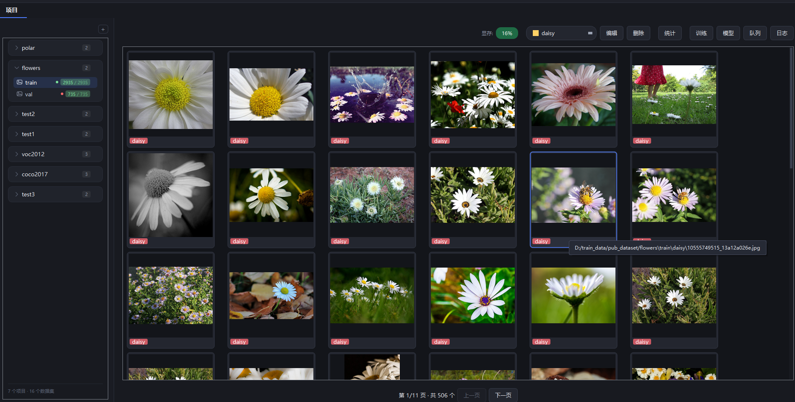

## ✨ Key Features

### 📁 Project & Dataset Management
Project tree on the left of the home page: create / add / delete / rename / import / export datasets and inspect properties; large-image preview + thumbnail grid on the right.

<p align="center">
  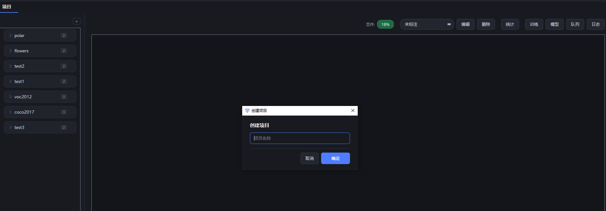
  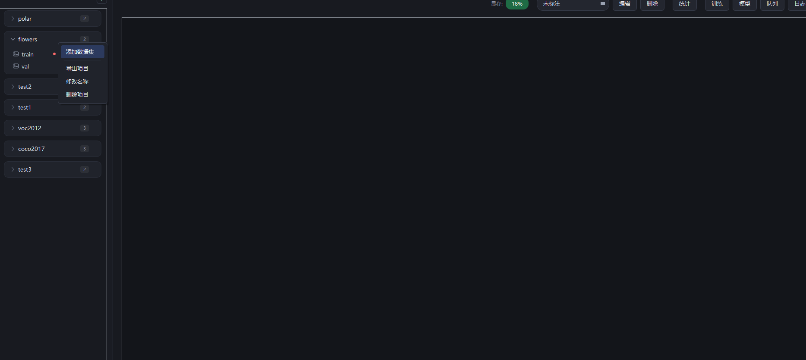
</p>

### 📥 Data Import
Single or batch import. For detection/segmentation/OCR choose an image directory + a label directory (labelme / YOLO txt); for classification enable "import by sub-folder" (sub-folder name = class). OCR labels are recognized by the text flag in the labelme json, and the dataset is marked as text-detection on import. Large datasets lazy-load thumbnails for near-instant display.

<p align="center">
  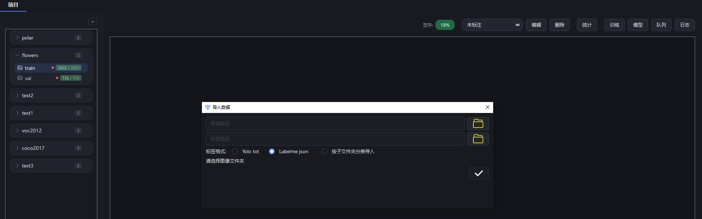
</p>

### 🏷️ Label Management
- **Add labels**: type names + 10 preset colors + custom color picker; multiple labels separated by commas
- **Import labels across datasets**: one-click copy all labels from another dataset in the same project (keeps source colors)
- **Change class**: click the label chip on a box inside the annotation view
- **Batch edit / delete**: merge or delete whole classes, automatically rewriting labelme json and the first id column of YOLO txt

<p align="center">
  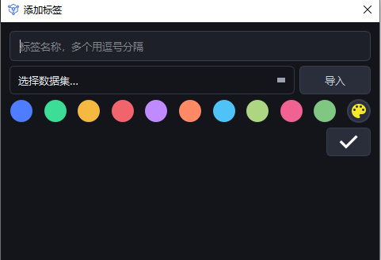
  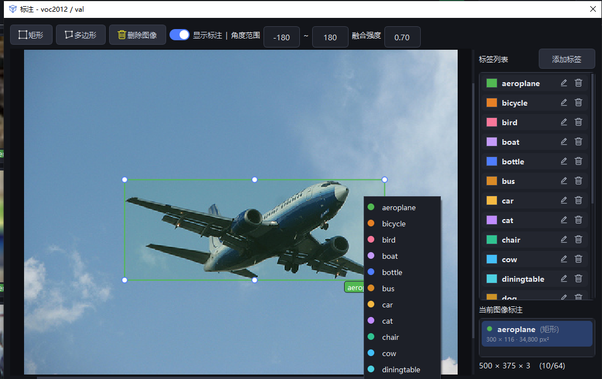
</p>

<p align="center">
  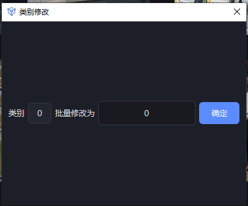
</p>

### ✏️ Annotation
- **Rectangle**: drag to draw (label chips stay a constant pixel size while zooming)
- **Polygon**: freehand tracing + automatic point thinning on close (trace color follows the selected label)
- **Text**: for OCR — draw a box then type its content (the label is fixed to "文本", kept out of the class list). Always annotate text with a **rectangle**: cover slanted text with a horizontal box too — OCR collapses polygons to their horizontal bounding box, so tracing a tight outline gains nothing
- **Format painter**: select a template region → paint copies anywhere (pixel copy, undoable)
- **Zoom / pan**: mouse-wheel zoom, Space + drag pan, resize handles, delete, show/hide boxes
- Shortcuts: A/D for prev/next, Q / Ctrl+Z, etc.

<p align="center">
  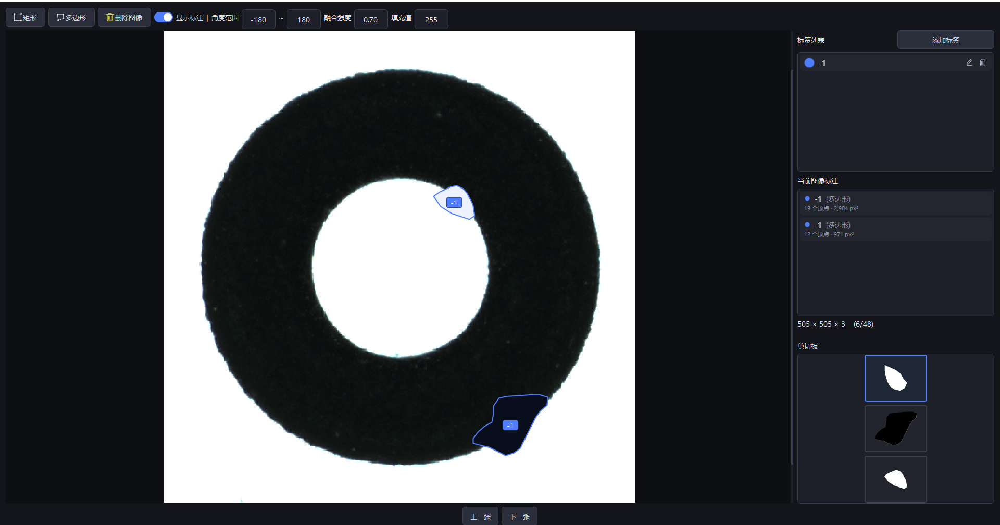
</p>

### 🖼️ Home Browsing & Filtering by Class
Filter thumbnails by label from the dropdown; images are paginated by cell count when multiple classes exist; the top-right shows the current filtered count.

<p align="center">
  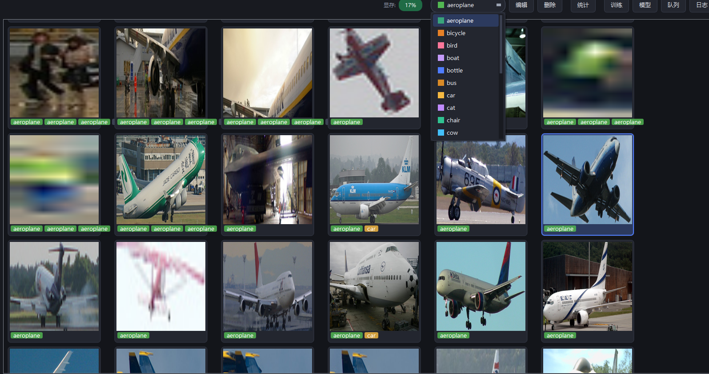
</p>

### 📊 Dataset Properties
Shows dataset paths and a label-distribution bar chart (descending by count; Top-N + "others" merged when there are many classes). Lists and axis are scrollable.

<p align="center">
  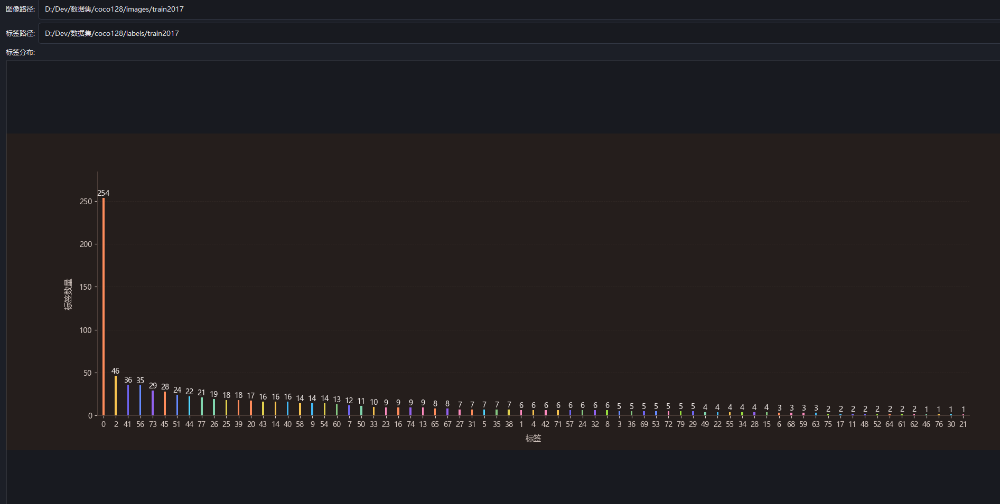
</p>

### 🚀 Training
Runs in a **child process without blocking the UI**: live progress bar, ETA, GPU memory usage, manual stop (5-second countdown). Detection/segmentation can use either RF-DETR (Transformer) or ultralytics YOLO (CNN); classification uses ResNet (18/34/50/101); anomaly detection uses PatchCore (normal samples only, no labelling needed); OCR uses docTR in two stages (detection DB / LinkNet + recognition CRNN). All network sizes map from a dropdown. A **training queue** is supported: several configurations run back to back, and it can be stopped at any time, with one-click re-queue after an interruption or failure. OCR enqueues two items at once (text detection + text recognition); the second starts once GPU memory falls back to the pre-run level.

<p align="center">
  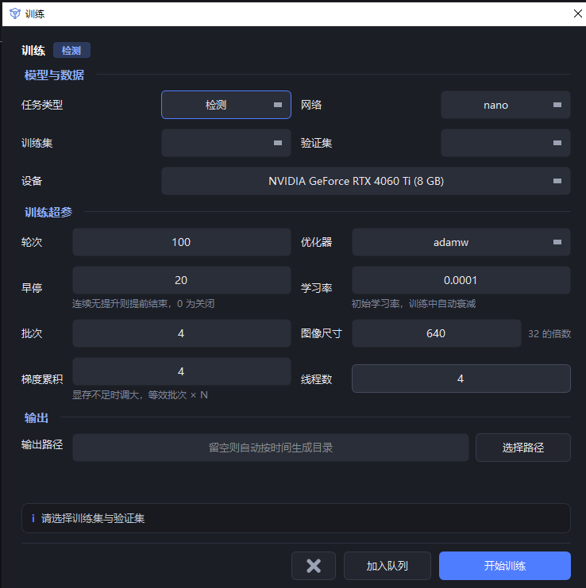
  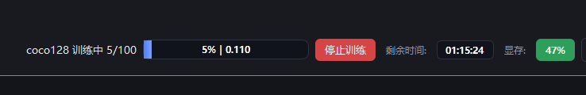
</p>

### 📈 Metrics Review
Model management → "Metrics" opens line charts: val loss + per-class mAP / mAR / F1 / Precision / Recall.

<p align="center">
  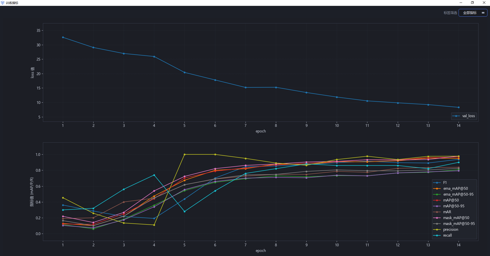
</p>

### 🗂️ Model Management
Training history list, filterable by project / task / model size / metric / image size; each record supports **test / metrics / export / delete**.

<p align="center">
  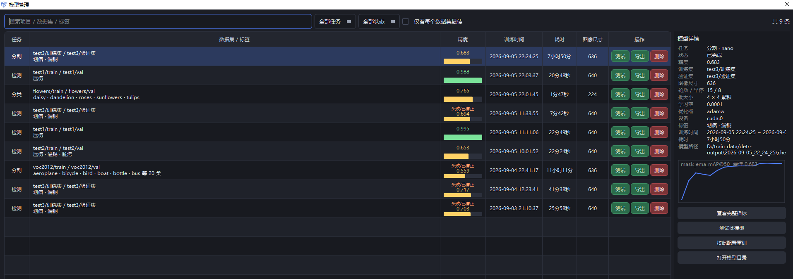
</p>

### 🧪 Model Testing
Configure data / device / model / confidence / IoU thresholds and run evaluation. Detection/segmentation output per-class P/R plus a global missed/false-positive analysis; classification outputs per-class correct/incorrect stats; anomaly detection gives an image-level verdict; OCR has two routes — text detection can either infer (writing label json) or evaluate (P/R + missed/false-positive), and text recognition reports CER plus the exact-match rate.

<p align="center">
  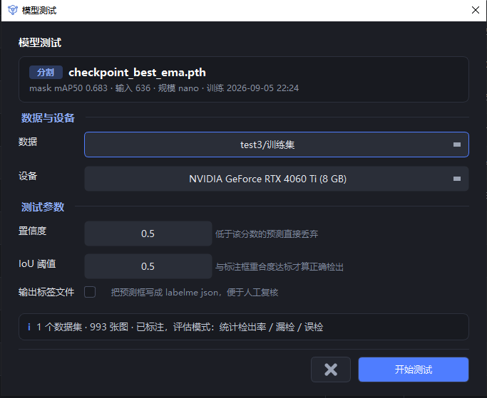
  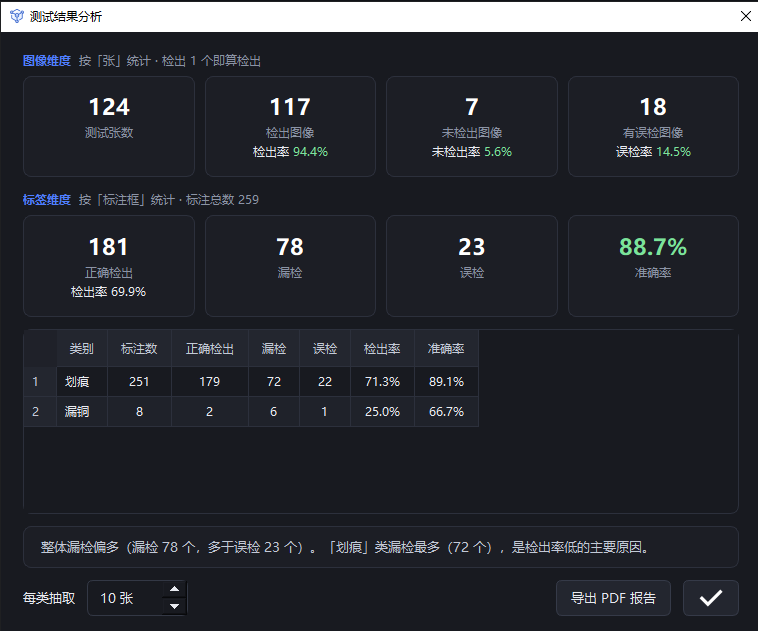
</p>

### 📜 Logs
Real-time training / testing / operation logs; errors pop up automatically. Logs rotate daily.

<p align="center">
  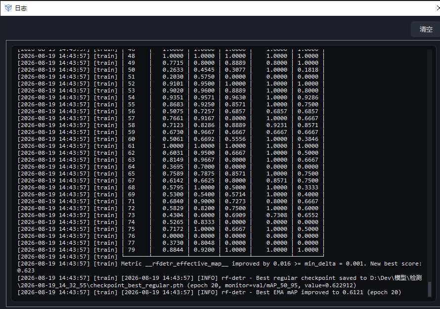
</p>

---

## 🛠 Requirements

| Dependency | Version | Notes |
|------|------|------|
| Python | ≥ 3.10 | RF-DETR requires Python 3.10+ |
| PySide6 | ≥ 6.6 | GUI framework |
| typing-extensions | ≥ 4.0 | Fixes the typing.Self conflict with PySide6 on 3.10 |
| lmdb | ≥ 1.4 | Local data store |
| Pillow | ≥ 9.0 | Image processing |
| matplotlib | ≥ 3.5 | Metric charts |
| numpy | ≥ 1.21 | Numeric computing |
| opencv-python-headless | ≥ 4.8 | Image I/O and resizing |

**Additional dependencies for training/inference** (install in a Python 3.10+ environment):

```bash
pip install torch torchvision
pip install "rfdetr[train]>=1.9.2" kornia   # detection / segmentation (train extra brings pytorch-lightning; augmentation needs kornia)
pip install "ultralytics>=8.3.0"            # detection / segmentation (CNN backend, optional)
pip install "anomalib>=2.6.2" scikit-learn  # anomaly detection (roc_auc_score for evaluation)
pip install "python-doctr>=1.0.1"           # OCR (text detection + recognition)
```

> When installing ultralytics, add `--no-deps` and install just the pure-Python deps it lacks — otherwise it pulls the GUI build of OpenCV and overwrites the project's `opencv-python-headless`.

**Additional dependencies for ONNX export** (only needed by Model Manager → Export):

```bash
pip install onnx onnxsim onnxruntime
```

## 🚀 Quick Start

```bash
# 1. Install base dependencies
pip install -r requirements.txt

# 2. Install training dependencies (Python 3.10+)
pip install torch torchvision "rfdetr[train]>=1.9.2" kornia "python-doctr>=1.0.1"

# 3. Install export dependencies (optional, for ONNX export)
pip install onnx onnxsim onnxruntime

# 4. Run
python app/easy_trainer.py
```

> 💡 Don't want to set up an environment, or need to hand this to a colleague/client? See the installer section below — one `installer.exe` and it's ready to use.

**Ubuntu (Linux) — source run** needs a few system libraries:

```bash
sudo apt install libxcb-cursor0 libxkbcommon-x11-0 libegl1 libgl1 \
                 libdbus-1-3 libxcb-icccm4 libxcb-image0 libxcb-keysyms1 libxcb-render-util0
sudo apt install fonts-noto-cjk   # Chinese fonts
```

## 📦 Packaging & Installation

Running from source is for development; to ship a ready-to-use package, use `builder/` + `installer/`.

### Build the package

| Platform | Command | Output |
|---|---|---|
| Windows | `python builder\build.py -t dist\program` | `dist\release\installer.exe` |
| Linux | `python3 builder/build.py -t dist/program` | `dist/release-linux/` (`installer.sh` + `program.zip` + requirements + asset list) |

`build.py` compiles all of `app/` and `ui/` into `.pyd` with Cython (`.so` on Linux), assembles `dist/program` (keeping `__init__.py`, `easy_trainer.py`, `style/`, `resources/` and `examples/` as plain files), zips it into `program.zip`, then calls the platform publisher and cleans up. Windows needs `cl.exe` (VS 2022 Developer PowerShell) and the .NET SDK 10; Linux needs `gcc` and `python3.10-dev`.

Building is purely local and **never touches the network**: the Python runtime and pretrained weights are fetched by the installer on the target machine. The `.pyd` / `.so` files are locked to the cp310 ABI, so **changing the Python version requires a rebuild and a re-release**; the same applies to any code change (`program.zip` is embedded into the exe at build time).

### Installing on a target machine

- **Windows**: just one `installer.exe` — double-click and tick the components. Silent install is also supported:
  ```powershell
  installer.exe --install D:\EasyTrainer runtime     # components: runtime / program / pretrained, comma-separated
  ```
- **Linux**: `./installer.sh [-d install_dir] [-p]` (`-p` also installs the pretrained weights, ~1.6GB)

| Component | Source | How |
|---|---|---|
| Application | Embedded into installer.exe at build time | Unzipped, no network |
| Runtime | Official Python 3.10 embeddable zip (Huawei Cloud mirror) | Unzip and use (green, no registry writes) |
| Dependencies (torch, ...) | Tsinghua PyPI + a dedicated torch index | Installed on the spot by pip (~3.3GB download) |
| Pretrained weights | Official sources (Google Storage + HuggingFace mirror) | Downloaded into `pretrained\` (~1.6GB) |

Disk space is estimated and validated up front for the selected components (~12GB with the runtime); downloads retry automatically on failure and pip falls back to a backup index. **Offline fallback**: drop `python-3.10.11-embed-amd64.zip` / `pretrained.zip` next to the installer and it is used preferentially, with no network access at all.

> On Windows, PyPI's `torch` is CPU-only; a GPU build requires `torch==2.7.1+cu128`, which only exists on the pytorch index — the requirements already pin it and layer the index with `--extra-index-url`.

Installed layout, startup chain and Linux-specific notes: see [installer/README.md](installer/README.md).

## 📂 Directory Structure

```
easy_trainer/
├── app/                    # Application
│   ├── easy_trainer.py     # Bootstrap: sets sys.path then hands over to main_window
│   ├── main_window.py      # Main window: projects/datasets, annotation, training/testing (sets RF_HOME at import)
│   ├── core/               # Data layer & common utilities
│   │   ├── db.py           # LMDB data access (YOLO label_ids, rename/merge, ...)
│   │   ├── utils.py        # CJK fonts, QSS loading, project-root lookup, text decoding
│   │   ├── constants.py    # Global constants (image extensions, page size, cache limits)
│   │   ├── metrics.py      # Metric reading (metrics.csv parsing, best mAP lookup)
│   │   ├── image_utils.py  # Image loading / thumbnails / format conversion
│   │   ├── label_utils.py  # Label normalization / sorting / colors, labelme ↔ YOLO
│   │   ├── log.py          # Rotating daily logs
│   │   └── keys.py         # LMDB key constants
│   ├── tasks/              # Background tasks (import / merge)
│   │   ├── import_task.py  # Dataset scan & import (detect/segment/classify/OCR)
│   │   └── merge_task.py   # Label merging
│   ├── annotation/         # Annotation canvas & annotation dialog
│   │   ├── scene.py        # Annotation scene (drag-to-draw, hit testing, undo stack)
│   │   ├── box_item.py     # Annotation items (boxes / polygons + label chips)
│   │   ├── annotation_dialog.py  # Annotation dialog (shell + side label/annotation lists)
│   │   ├── annotation_canvas.py  # Annotation canvas (zoom/pan, rect/polygon/format painter, params & clipboard)
│   │   ├── annotation_io.py      # Annotation I/O (image loading/cache, labelme JSON, template import/export)
│   │   ├── blend.py        # Format-painter paste blending (Lab luminance match + feathering)
│   │   └── scene_items.py  # Auxiliary scene items
│   ├── widgets/            # Shared UI widgets
│   │   ├── message_box.py  # Message & progress dialogs
│   │   ├── dialog_buttons.py     # Unified dialog buttons & icons
│   │   ├── name_input_dialog.py  # Name input dialog
│   │   ├── paginator.py    # Pagination control
│   │   ├── project_sidebar.py    # Home project/dataset sidebar (card tree)
│   │   ├── charts.py       # Custom charts (label distribution bars)
│   │   ├── status_style.py # Task status text & colors
│   │   ├── queue_dialog.py # Training queue dialog
│   │   ├── log_dialog.py   # Log viewer dialog
│   │   ├── model_dialog.py # Model management (history, metrics, test, export)
│   │   ├── test_dialog.py  # Test parameter dialog
│   │   └── metrics_dialog.py   # Training metric charts
│   ├── mixins/             # Main-window mixins (projects/datasets/annotation/training/queue/import-export)
│   └── train/              # Training & testing execution
│       ├── proc_utils.py   # Shared base for training/testing subprocesses (launch expression, teardown)
│       ├── train_worker.py # Training subprocess thread (progress/metrics/result signals)
│       ├── train_runner.py # Training entry dispatcher (forwards by architecture to the two impls below)
│       ├── transformer_train_runner.py  # Detect/segment training (RF-DETR)
│       ├── cnn_train_runner.py          # Detect/segment training (ultralytics YOLO)
│       ├── transformer_backend.py / cnn_backend.py  # Backend adapters (model loading / device / result normalisation)
│       ├── task_spec.py    # Task-spec base class (single home for per-task differences)
│       ├── detect_common.py / segment_common.py     # Detect / segment task specs
│       ├── classify_common.py / classify_model.py   # Classification architecture table / model builder (ResNet)
│       ├── classify_train_runner.py   # Classification training script (per-class accuracy)
│       ├── ad_common.py / ad_package.py    # Anomaly detection: backbone cache & model packaging
│       ├── ad_train_runner.py / ad_test_runner.py     # Anomaly detection training / testing
│       ├── ocr_common.py / ocr_data.py / ocr_weights.py   # OCR architecture table / data layout / weight provisioning
│       ├── ocr_train_runner.py / ocr_test_runner.py       # OCR two-stage training / testing
│       ├── data_prep.py    # Training data prep (YOLO conversion, class collection)
│       ├── test_worker.py  # Test subprocess thread
│       ├── test_runner.py  # Detect/segment test script
│       ├── classify_test_runner.py   # Classification test script
│       ├── test_errors.py  # Missed/false-positive analysis
│       ├── test_report.py  # Evaluation report (PDF)
│       ├── test_result_dialog.py  # Evaluation result dialog
│       ├── onnx_export.py  # ONNX export (rfdetr for detect/segment, torch.onnx for classify/OCR)
│       ├── export_worker.py  # Export background thread
│       └── dialogs.py      # Training/testing dialogs
├── examples/               # ONNX usage examples (copied to the export directory on export)
│   ├── cpp/                # C++ (ONNX Runtime + OpenCV)
│   ├── csharp/             # C# (Microsoft.ML.OnnxRuntime + OpenCvSharp4)
│   └── python/             # Python (onnxruntime + opencv)
├── builder/                # Packaging & release (Windows / Linux)
│   ├── build.py            # One-shot release: Cython compile → program.zip → platform publisher
│   ├── requirements-release.txt  # Pinned release dependencies (embedded in the installer)
│   ├── pretrained-assets.txt     # Pretrained weight manifest (single source for all three ends)
│   └── get-pip.py          # pip bootstrap (embedded in installer.exe)
├── installer/              # Installers
│   ├── Win.installer/      # C# installer (dotnet publish → installer.exe)
│   ├── installer.sh        # Linux install script (venv + unzip + pip + .desktop entry)
│   └── README.md           # Installer & release pipeline details
├── ui/                     # PySide6 UI classes (generated from .ui)
├── docs/                   # Design docs + README screenshots
├── resources/              # Icons & resources
├── style/                  # QSS stylesheet
├── requirements.txt
├── README.md               # Chinese README
└── README.en.md            # English README (this file)
```

## 🧭 Workflow

1. **Create a project** → add a dataset under it
2. **Import data**: right-click the dataset → Import. For detection/segmentation/OCR pick an image directory + a label directory (labelme/yolo); for classification enable "import by sub-folder"
3. **Annotate**: double-click an image in the dataset to enter the annotation view (rectangle/polygon/text/format painter), A/D to flip pages, labelme json is saved automatically
4. **Train**: toolbar "Train" → pick task type (detect/segment/classify/anomaly detection/OCR) → configure parameters → start (5-second countdown, then runs in background)
5. **Test**: Model management → record "Test" → configure → run evaluation
6. **Review metrics**: Model management → "Metrics" opens the accuracy curves
7. **Export model**: Model management → record "Export". Detect/segment/classify produce `project_task_size_scale.onnx` + `label_map.json` + evaluation report PDF + usage examples; OCR exports one ONNX per stage (the recognition stage also ships `vocab.txt`); anomaly detection cannot export ONNX and ships a `.pt` package (`threshold.txt` / `result.json`)

> 💡 Training image sizes: detection default **640** (multiple of 32), segmentation default **648** (multiple of 12 for nano, 24 for the other three scales), classification default **224**, text detection default **1024** (multiple of 32; the recognition stage is fixed at 32×128 and ignores this). The note beside the input and the hover tooltip show the valid values for the current scale.

## 💾 Data Storage

- **App data**: `~/.easy_trainer/app.mdb` (LMDB — projects/datasets bindings, labels, training history, deleted records, etc.)
- **Training output**: timestamped directories under each task's output path (`config.json` / `result.json` / `metrics.json` / `checkpoint_best.pth` / `classes.txt`)
- **Logs**: `logs/app.log` (rotated daily)

## 📝 Docs

- [Migration plan / design doc](docs/migration_plan.md)
- [User guide](docs/使用教程.pdf)
- [Installer & release pipeline](installer/README.md)
