# Easy Trainer

> 基于 PySide6 的本地图像标注与深度学习训练工具，支持**目标检测 / 图像分割 / 图像分类**三类任务的标注、训练、测试与模型管理全流程。数据存储于本地 LMDB，无需联网即可完成 **标注 → 训练 → 评估** 闭环。

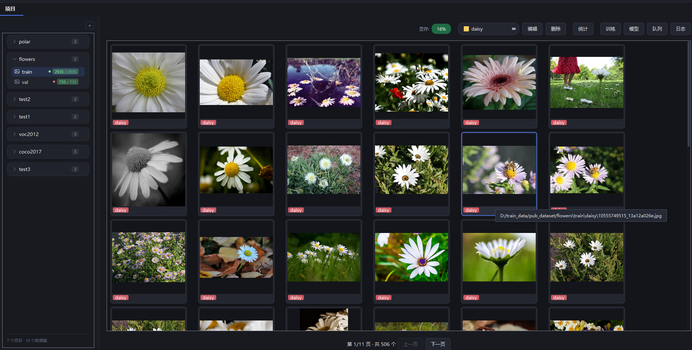

## ✨ 核心特性

### 📁 项目与数据集管理
首页左侧项目树，支持多项目 / 多数据集的创建、添加、删除、修改、导入、导出、属性查看；右侧大图浏览 + 缩略图网格。

<p align="center">
  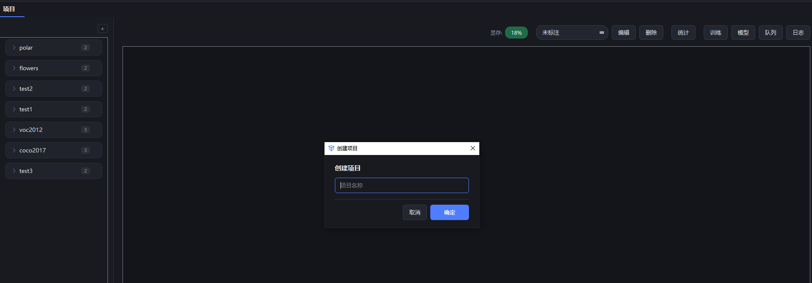
  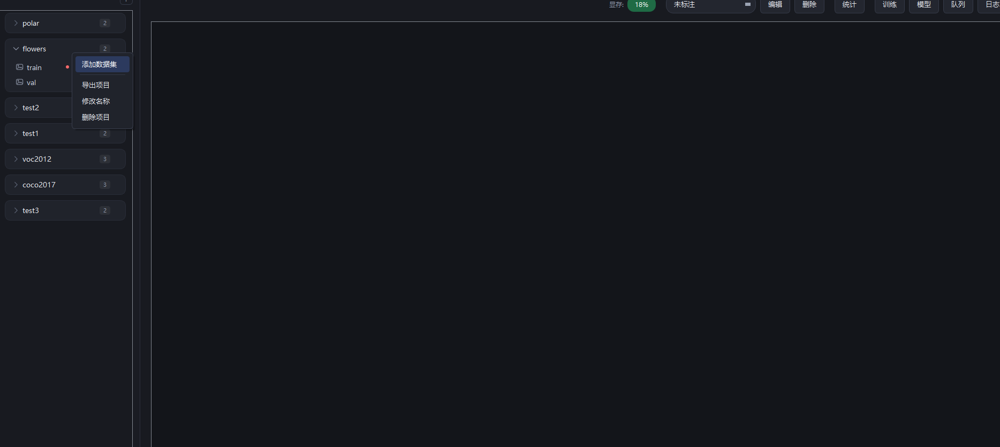
</p>

### 📥 数据导入
支持单图或批量导入，检测/分割选图像目录 + 标签目录（labelme / YOLO txt），分类勾选"按子文件夹分类导入"（子文件夹名即类别）。大数据集懒加载缩略图，秒级呈现。

<p align="center">
  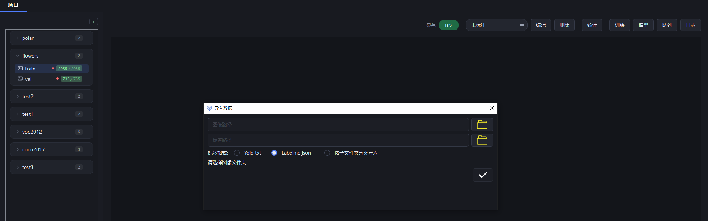
</p>

### 🏷️ 标签管理
- **添加标签**：手动输入 + 10 种预设色 + 自定义颜色拾色器，多个标签用逗号分隔
- **跨数据集导入**：一键把同项目下其他数据集的标签全部导入（沿用源颜色）
- **修改类别**：标注界面直接点击框的标签 chip 切换类别
- **批量修改 / 删除**：合并 / 整类删除，自动改 json + 标签 txt 行首 id

<p align="center">
  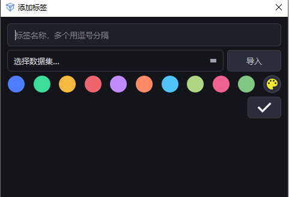
  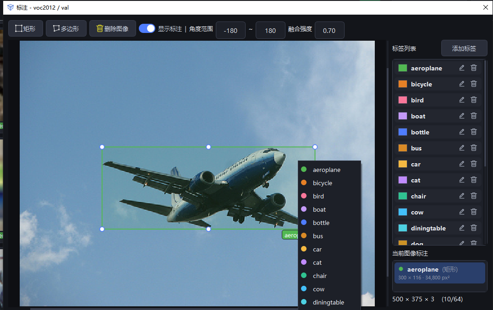
</p>

<p align="center">
  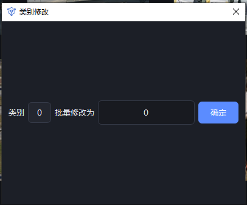
</p>

### ✏️ 图像标注
- **矩形**：拖拽绘制（chip 标签随缩放恒定大小）
- **多边形**：轨迹描边 + 自动抽稀闭合（轨迹颜色跟随所选标签）
- **格式刷**：圈选模板 → 任意位置刷子粘贴（像素复制，可撤销）
- **缩放 / 平移**：滚轮缩放、Space + 拖拽平移、缩放手柄、删除、显示标注开关
- A/D 翻页、Q/Ctrl+Z 等快捷键

<p align="center">
  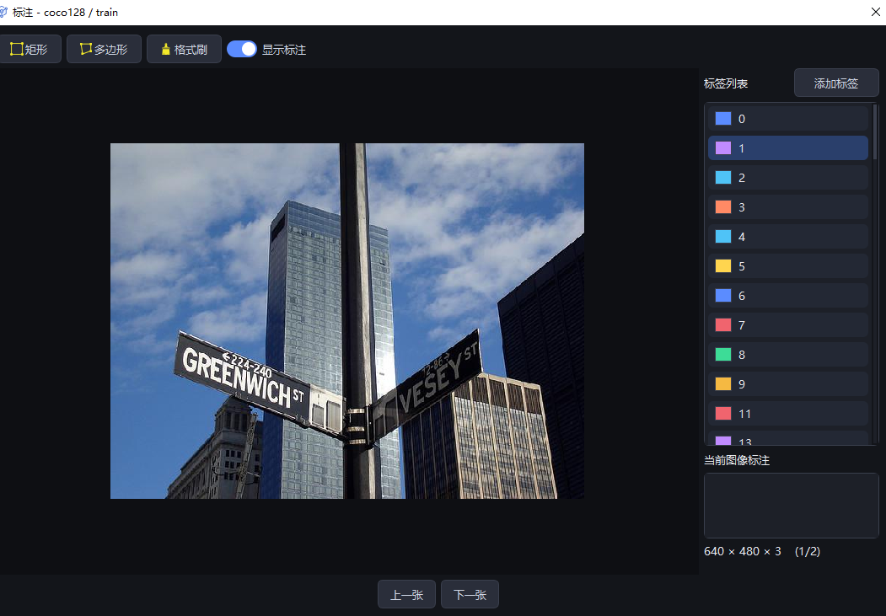
</p>

### 🖼️ 首页浏览与按类筛选
标签下拉框按类别筛选缩略图，多类时图按数量分页（"共 N 个"按 cell 数），右上角统计当前筛选数量。

<p align="center">
  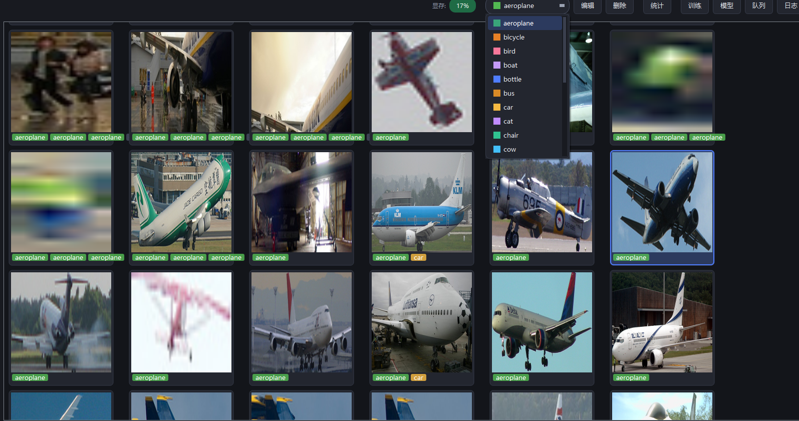
</p>

### 📊 数据集属性
查看数据集路径、标签分布柱状图（按数量降序，类多时 Top-N + 其他合并），列表与横轴支持滚动。

<p align="center">
  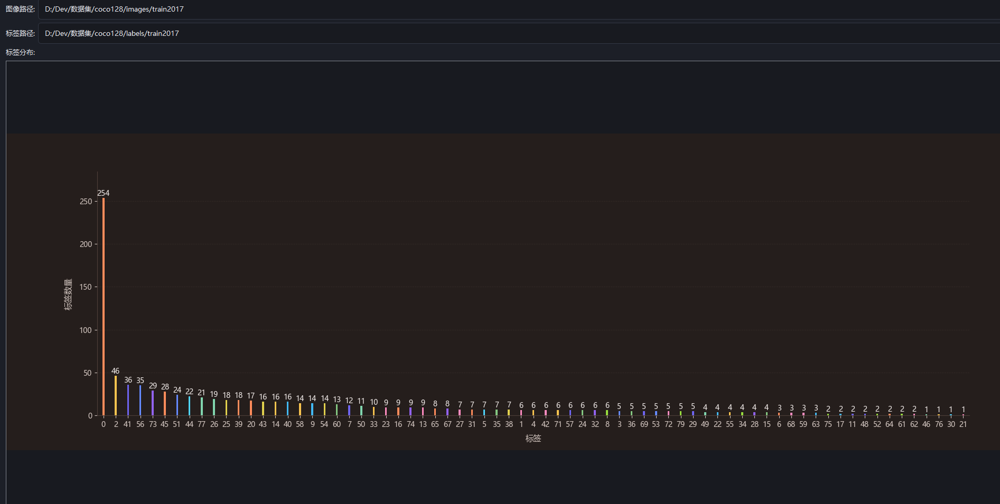
</p>

### 🚀 训练
**子进程执行不阻塞 UI**，实时进度条、剩余时间、显存占用，支持手动停止（5 秒倒计时）。检测/分割走 RF-DETR，分类走 ResNet（18/34/50/101），所有网络尺寸下拉映射。

<p align="center">
  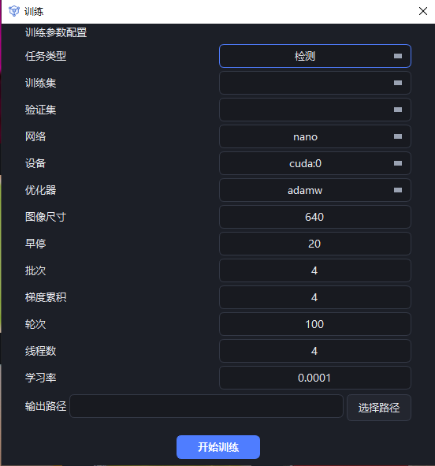
  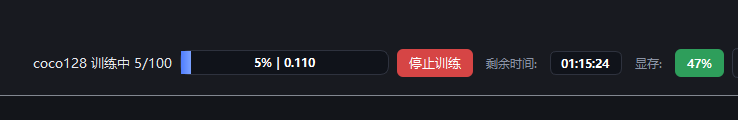
</p>

### 📈 训练指标回看
模型管理 → "指标" 打开折线图：val loss + 每类 mAP / mAR / F1 / Precision / Recall 全指标折线。

<p align="center">
  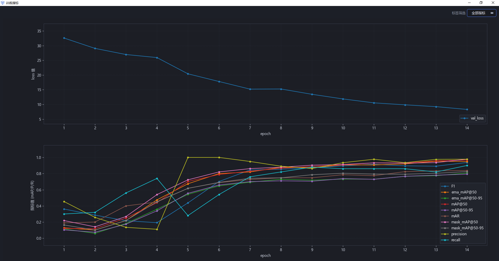
</p>

### 🗂️ 模型管理
训练历史列表，按项目/任务/模型规模/精度/图像尺寸筛选，每条记录支持 **测试 / 指标 / 导出 / 删除**。

<p align="center">
  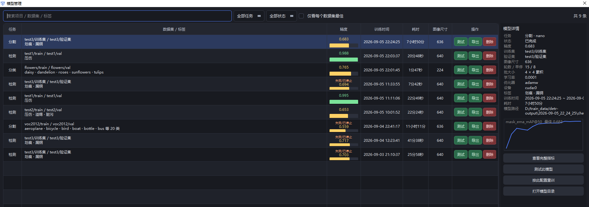
</p>

### 🧪 模型测试
配置数据 / 设备 / 模型 / 置信度 / IoU 阈值，运行评估。检测/分割输出每类 P/R + 整体漏检误检分析；分类输出每类正确/错误统计。

<p align="center">
  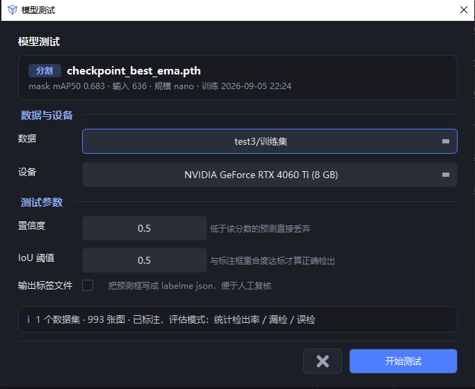
  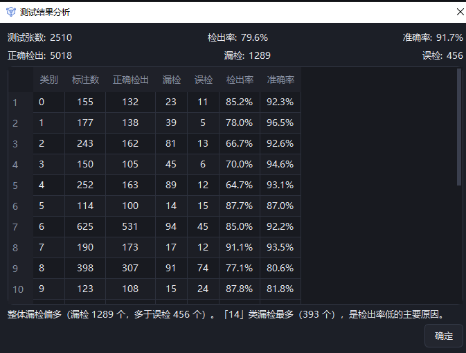
</p>

### 📜 日志
训练 / 测试 / 操作日志实时输出，异常自动弹窗。日志按天归档。

<p align="center">
  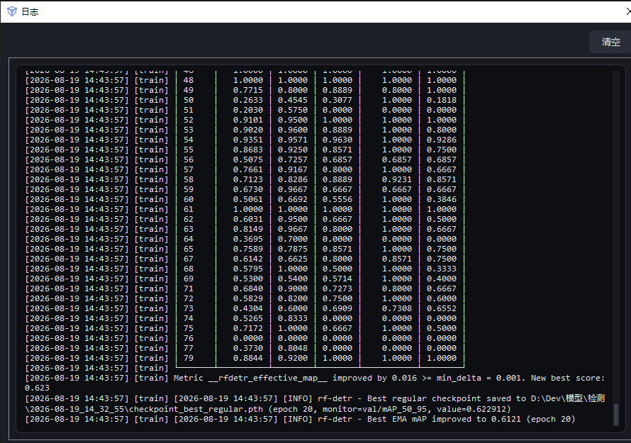
</p>

---

## 🛠 环境要求

| 依赖 | 版本 | 说明 |
|------|------|------|
| Python | ≥ 3.10 | RF-DETR 要求 Python 3.10+ |
| PySide6 | ≥ 6.6 | GUI 框架 |
| lmdb | ≥ 1.4 | 本地数据存储 |
| Pillow | ≥ 9.0 | 图像处理 |
| matplotlib | ≥ 3.5 | 指标曲线绘制 |
| numpy | ≥ 1.21 | 数值计算 |

**训练 / 推理额外依赖**（需在 Python 3.10+ 环境安装）：

```bash
pip install torch torchvision
pip install "rfdetr>=1.9.2"
```

## 🚀 快速开始

```bash
# 1. 安装基础依赖
pip install -r requirements.txt

# 2. 安装训练依赖（Python 3.10+）
pip install torch torchvision "rfdetr>=1.9.2"

# 3. 启动
python app/main.py
```

## 📂 目录结构

```
easy_trainer/
├── app/                    # 主程序
│   ├── main.py             # 主窗口：项目/数据集管理、标注渲染、训练/测试入口
│   ├── core/               # 数据访问层与通用工具
│   │   ├── db.py           # LMDB 数据访问层（YOLO label_ids、重命名合并等）
│   │   ├── utils.py        # 通用工具（matplotlib 中文字体、QSS 加载、项目根定位）
│   │   ├── image_utils.py  # 图像加载/缩略图/格式转换
│   │   ├── label_utils.py  # 标签归一化/排序/颜色
│   │   ├── log.py          # 滚动日志（按天归档）
│   │   └── keys.py         # LMDB 键名常量
│   ├── tasks/              # 后台任务（导入/合并）
│   │   ├── import_task.py  # 数据集扫描导入（检测/分割/分类）
│   │   └── merge_task.py   # 标签合并
│   ├── annotation/         # 标注画布场景 + 标注弹窗
│   │   ├── scene.py        # 标注场景（矩形/多边形/格式刷）
│   │   ├── view.py         # 画布视图（缩放/平移）
│   │   ├── box_item.py     # 标注图形项（矩形框 + 标签 chip）
│   │   ├── annotation_dialog.py  # 标注弹窗（画框/多边形/格式刷/分类改类）
│   │   └── scene_items.py  # 场景辅助图形项
│   ├── widgets/            # 通用 UI 组件
│   │   ├── message_box.py  # 统一消息框/进度对话框
│   │   ├── paginator.py    # 分页控件
│   │   ├── log_dialog.py   # 日志查看弹窗
│   │   ├── model_dialog.py # 模型管理（历史记录、精度、测试、导出）
│   │   ├── test_dialog.py  # 测试参数弹窗
│   │   └── metrics_dialog.py   # 训练指标折线图
│   ├── mixins/             # 主窗口功能扩展（项目/数据集/标注/训练/导入导出）
│   └── train/              # 训练与测试执行
│       ├── train_worker.py # 训练子进程线程（进度/指标/结果信号转发）
│       ├── train_runner.py # 检测/分割训练脚本（RF-DETR）
│       ├── classify_train_runner.py  # 分类训练脚本（ResNet + 每类精度）
│       ├── test_worker.py  # 测试子进程线程
│       ├── test_runner.py  # 检测/分割测试脚本
│       ├── classify_test_runner.py   # 分类测试脚本
│       └── dialogs.py      # 训练/测试弹窗
├── ui/                     # PySide6 UI 类（.py 由 .ui 编译生成）
├── docs/                   # 设计文档 + README 截图
├── resources/              # 图标等资源
├── style/                  # QSS 样式表
├── requirements.txt
└── README.md
```

## 🧭 使用流程

1. **新建项目** → 在项目下添加数据集
2. **导入数据**：右键数据集 → 导入。检测/分割选图像目录 + 标签目录（labelme/yolo），分类勾选"按子文件夹分类导入"
3. **标注**：双击数据集图像进入标注界面（矩形/多边形/格式刷），A/D 翻页，自动保存 labelme json
4. **训练**：工具栏"训练" → 选任务类型（检测/分割/分类）→ 配置参数 → 开始训练（5 秒倒计时后进入后台执行）
5. **测试**：模型管理 → 某条记录"测试" → 配置 → 运行评估
6. **回看指标**：模型管理 → "指标" 打开精度曲线
7. **导出模型**：模型管理 → 某条记录"导出"，生成 `项目_任务_尺寸_规模.pth` + `classes.txt`

> 💡 训练图像尺寸：检测默认 **640**、分割默认 **636**（12 的倍数）、分类默认 **224**。输入框悬停可见推荐值。

## 💾 数据存储

- **应用数据**：`~/.easy_trainer/app.mdb`（LMDB，保存项目/数据集绑定、标签、训练历史、删除记录等）
- **训练输出**：各任务 `输出路径` 下的时间戳目录（`config.json` / `result.json` / `metrics.json` / `checkpoint_best.pth` / `classes.txt`）
- **运行日志**：`logs/app.log`（滚动按天归档）

## 📝 文档

- [迁移计划 / 设计文档](docs/migration_plan.md)
- [使用教程](docs/使用教程.pdf)
